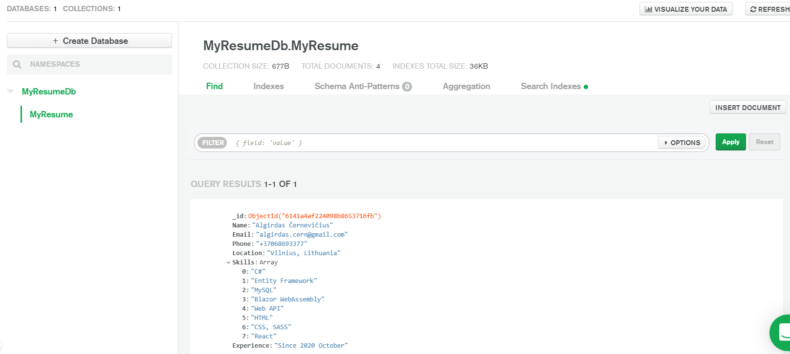

# ACResume Application

* IDE - Visual Studio Community 2019.
* Solution consists of 3 projects:
  * Web API
  * Data application layer (DAL class library) - Database modeling.
  * Shared(Data Transfer Object, DTO) class library - inbetween class library, a bridge between database model and DTO model.

To map to database model with DTO model I am using AutoMapper (a mapping of properties in the class).

### I have created a reccord (MyResume) with swagger.

### I have also created a NoSQL db - MongoDb Atlas and succesfully added a record into a Cluster0 Databse.

  
